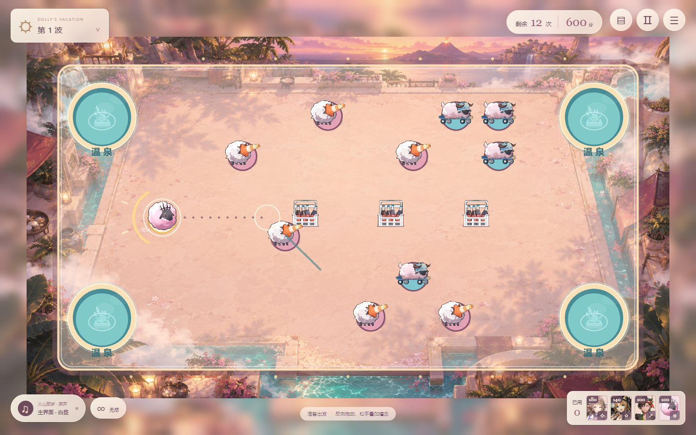
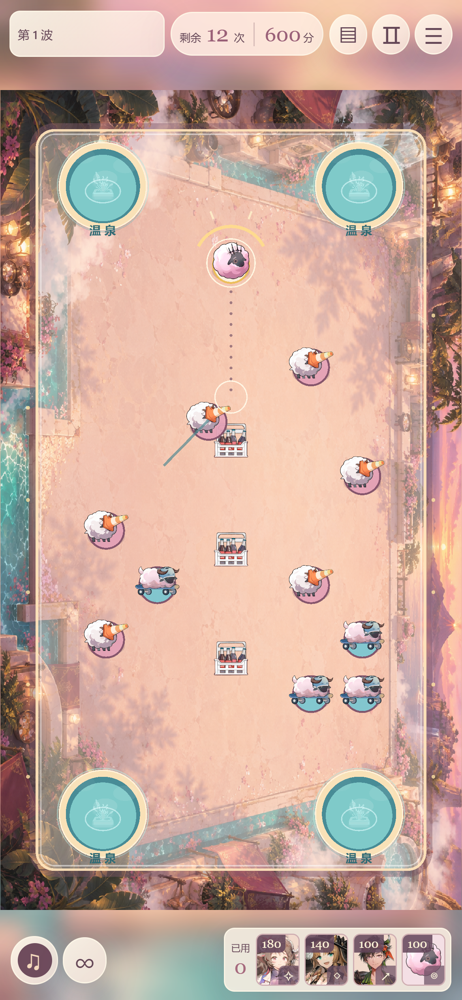

# 多利的假期 · Dolly’s Vacation

以《明日方舟》「火山旅梦」为主题的免费同人 2D 碰撞游戏。控制多利，把小羊送入温泉，用连锁爆破、双色水汽和高压水渠组合清场。

**[开始游戏](https://midvoy.github.io/DollyVacation/)**

## 操作方式

1. 在场地内按住鼠标或触摸屏，向前进方向的反方向拖动，松手施加撞击。拉得越远，冲量越大。
2. 每次发射后 **10 秒**，或全场停稳后，即可再次发射。运动中补发会叠加原有动量；反向撞击也可用于刹车。多利周围的环显示冷却进度，球体下方不显示标签。
3. 所有泉口通用。把目标小羊全部送入温泉，即可完成关卡或进入下一波。
4. 左下角 **∞** 可直接进入无尽模式，无需通关。唱片按钮切换音乐；右上角查看图鉴、暂停或打开菜单。

电脑也支持方向键微调、空格撞击和 Esc 暂停。手机支持横竖屏，上下各保留一行主要控件。虚线表示叠加后的初始方向，不预测后续力场。游戏不提供撤销。

## 无尽假期

- 初始 **12 次撞击、600 积分、10 只小羊**。每波增加 2 只小羊，最多 28 只。
- 清场补至至少 12 次，再奖励 2 次，最多保留 18 次；另奖励 **500 + 当前波次 × 100** 分，下一波自动开始。
- 第 2 波加入巡逻移动温泉，第 3 波加入定时喷发的间歇泉，第 4 波起随机生成临时喷口，第 7 波起增加护罩羊密度。
- 连入、反弹、爆破、水渠、引力、斥力、喷发与长距离入泉均可组合加分。最高积分和最高完成波次保存在当前浏览器。
- 最后一次撞击最多继续结算 20 秒；全场停稳会提前结束。暂停时计时停止，多利落泉自动回到安全位置。

## 援助与机制

四位援助可以混合使用，放置后立即生效。闯关模式援助免费且不限使用次数；无尽模式按下表扣除积分，按钮显示价格。

| 援助 | 效果 | 无尽花费 |
| --- | --- | ---: |
| 纯烬艾雅法拉 | 点击空地部署连锁爆弹汽水；冲击波炸飞附近羊球并引爆相邻汽水 | 180 分 |
| 琳琅诗怀雅 | 拖动绘制高压金币水渠，球沿绘制方向加速并修正路线 | 140 分 |
| 苍苔 | 点击放置纯白水汽，持续向外推开球 | 100 分 |
| 多利 | 点击放置洋红水汽，持续把羊群吸向中心 | 100 分 |

援助水汽与水渠持续 18 秒。水渠支持曲线，柔和弯道更容易通过。为保持画面与性能，场上同时最多存在 16 瓶未引爆汽水、12 个援助水汽或水渠。

温泉“淘气包”无额外特性；温泉“流浪汉”阻力较低、滑行更远；“大个子”的护罩完整时固定不动。**第一次撞击反弹并破罩，第二次命中才能推动大个子**；一轮连锁爆炸只破罩，不会立即推走它。

入泉连击伴随粒子和升调短音效；护罩破碎、爆弹引爆及长途反弹入泉触发约 0.2 秒慢镜头与轻微震动。可在设置中关闭动态效果或短音效。5 首活动原版主界面与战斗 BGM 仍可自由切换。

## 闯关与存档

保留原有 16 关旅程、星级挑战和浏览器存档。第 4 关起，多利落泉会额外消耗 1 次撞击；无尽模式不额外扣次数。无尽记录与闯关星星分别保存，新开无尽不会清除星星。当前无尽对局不跨刷新恢复。

图鉴收录全部小羊与场地效果，详细说明受力方向、护罩、喷发、花式积分和冷却规则。上述物理特性与技能均属于本同人游戏的玩法改编。

## 手机画面

## 版权与素材说明

本项目为非官方、非商业同人作品，与鹰角网络及《明日方舟》运营方无官方关联。原作角色、世界观、角色立绘、模型、图像和音乐的著作权及其他相关权利归鹰角网络及相应权利人所有。

- 多利、小羊及水汽汽水瓶使用原游戏模型渲染；干员技能特写使用原游戏立绘。
- 泉口使用原版“景观喷泉”图标，蒸汽借用原模型云雾部件。温泉水面、范围提示及相关玩法表现为同人绘制与改编。
- 场景背景为 AI 辅助创作的同人图像。
- BGM 使用「火山旅梦」活动原版音轨。音乐版权归原权利人；可通过游戏内播放器访问塞壬唱片官方曲目页面。

素材资料参考 [PRTS Wiki](https://prts.wiki/w/火山旅梦)、[Arknights Terra Wiki](https://arknights.wiki.gg/wiki/So_Long,_Adele) 和 [塞壬唱片-MSR](https://monster-siren.hypergryph.com/)。引擎使用 Phaser 3 与 Matter.js，相关许可见 [第三方说明](site/THIRD_PARTY_NOTICES.txt)。

本仓库的公开可访问性不构成对原作素材的授权，也不授予第三方商业使用或再分发这些素材的权利。
