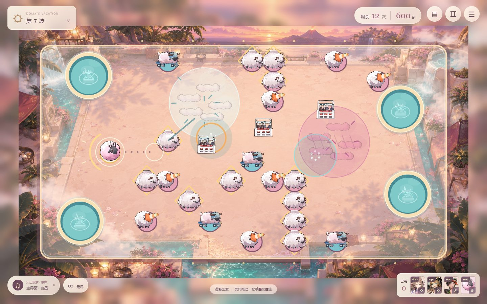
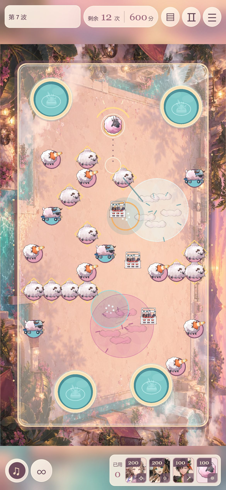

# 多利的假期 · Dolly’s Vacation

以《明日方舟》「火山旅梦」为主题的免费同人 2D 碰撞游戏。控制多利，把小羊送入温泉，用连锁爆破、双色水汽和高压水渠组合清场。

**[开始游戏](https://midvoy.github.io/DollyVacation/)**

## 操作方式

1. 在场地内按住鼠标或触摸屏，向前进方向的反方向拖动，松手施加撞击。拉得越远，冲量越大。
2. 每次发射后 **5 秒**，或全场停稳后，即可再次发射。运动中补发会叠加原有动量；反向撞击也可用于刹车。多利周围的环显示冷却进度，球体下方不显示标签。
3. 所有泉口通用。把目标小羊全部送入温泉，即可完成关卡或进入下一波。
4. 左下角 **∞** 可直接进入无尽模式，无需通关。唱片按钮切换音乐；右上角查看图鉴、暂停或打开菜单。

电脑也支持方向键微调、空格撞击和 Esc 暂停。手机支持横竖屏，上下各保留一行主要控件。虚线表示叠加后的初始方向，不预测后续力场。游戏不提供撤销。

## 无尽假期

- 初始 **12 次撞击、600 积分、10 只小羊**。每波增加 2 只小羊，最多 28 只。
- 每次清场补充 **5 次**，最多保留 **15 次**；另奖励 **250 + 当前波次 × 50** 分，下一波自动开始。
- 每波重新布置温泉、水汽、汽水和喷口；小羊初始位置避开洋红与纯白水汽、温泉、汽水和间歇泉。临时喷口生成时避开所有活动羊球，包括多利；空地不足时跳过本次生成。
- 第 2 波加入巡逻移动温泉，第 3 波加入定时喷发的间歇泉，第 4 波起随机生成临时喷口，第 7 波起增加护罩羊密度。
- 每只小羊基础 **25 分**；连入每级 **10 分**（最多 12 级），每种花式 **15 分**，每次边缘反弹 **5 分**（最多 4 次）。连入、反弹、爆破、水渠、引力、斥力、喷发与长距离入泉均可组合加分。最高积分和最高完成波次保存在当前浏览器。
- 最后一次撞击最多继续结算 20 秒；全场停稳会提前结束。暂停时计时停止，多利落泉自动回到安全位置。

## 援助与机制

多利停稳后才能放置援助，其他小羊仍在运动时可以部署。四位援助可以混合使用；闯关免费且不限次数。无尽模式的基础价如下，每位援助按各自累计使用次数独立涨价：每次使用后该援助的价格翻倍。例如汽水为 200、400、800 分，水汽为 100、200、400 分。次数跨波保留，重新开始后重置，按钮显示下一次价格。

| 援助 | 效果 | 无尽基础价 |
| --- | --- | ---: |
| 纯烬艾雅法拉 | 点击空地部署连锁爆弹汽水；冲击波炸飞附近羊球并引爆相邻汽水 | 200 分 |
| 琳琅诗怀雅 | 拖动绘制高压金币水渠，球沿绘制方向加速并修正路线 | 200 分 |
| 苍苔 | 点击放置纯白水汽，持续向外推开球 | 100 分 |
| 多利 | 点击放置洋红水汽，持续把羊群吸向中心 | 100 分 |

玩家放置的汽水、水汽与水渠，在多利下一次恢复主动发射时消失；准备好时放置的道具会保留到下一次撞击后恢复。地图自带机关不会因此消失。水渠支持曲线，柔和弯道更容易通过。为保持画面与性能，场上同时最多存在 16 瓶未引爆汽水、12 个援助水汽或水渠。

温泉“淘气包”无额外特性；温泉“流浪汉”阻力较低、滑行更远；“大个子”的护罩完整时固定不动。**第一次撞击反弹并破罩，第二次命中才能推动大个子**；一轮连锁爆炸只破罩，不会立即推走它。

入泉连击伴随粒子和升调短音效；护罩破碎、爆弹引爆及长途反弹入泉触发约 0.2 秒慢镜头与轻微震动。可在设置中关闭动态效果或短音效。5 首活动原版主界面与战斗 BGM 可自由切换，支持随机播放、顺序播放和单曲循环。首曲在进入网页时提前下载；画面与首曲就绪后，点击“开始假期”即可播放。网络较慢时可选择静音进入。每首完整下载后才开始播放，加载时显示进度；暂停、调整音量与切换播放模式不会重置当前进度。

## 假期成就

菜单中可查看 **21 项成就**。未解锁时只显示条件与进度；达成后弹出简短提醒，揭晓成就名称。内容覆盖累计入泉、连续入泉、反弹与长途、爆破和引力组合、场地机关、四位援助、教学通关、无尽波次以及无援助清场。成就保存在当前浏览器，重开对局不会丢失。

## 全球排行榜

无尽可在暂停菜单主动结算，保留当前积分。无尽结束后可自愿提交玩家 ID 与本局最终积分，留空默认为“未知玩家”。积分榜和波次榜各展示前 **1000** 名，每页 50 名；提交后立即显示自己的积分、完成波数与两个榜单名次，榜外玩家也能查看自己的位置。

每位玩家的两项最佳纪录分别保留。积分榜先比较积分，再比较完成波数；波次榜先比较波数，再比较积分；仍相同时按达成时间排序。昵称允许重名，同一浏览器保留匿名身份，换设备或清除网站数据后成为新玩家。仅选择提交后公开昵称与成绩，无需注册玩家账号。

菜单与无尽模式入口均可查看排行榜。网络断开不影响继续游戏；联网记录建立失败的对局会明确提示，成绩不会伪装成全球排名。榜单属于休闲挑战记录，客户端成绩校验不能完全防止作弊。

## 闯关与存档

16 关重排为 8 组“教学＋实战”：撞击、反弹滑行、护罩、连锁爆弹、引力、斥力、水渠与动态场地。每关开场暂停，点击屏幕逐步阅读提示；第一关另有按钮教学，菜单可随时重看。闯关与无尽中多利落泉均不额外扣次数。原版关卡纪录单独归档，已解锁进度保留，新课程重新记录星级。无尽记录与闯关星星分别保存，新开无尽不会清除星星。当前无尽对局不跨刷新恢复。v0.8 再次调整积分与援助价格，旧版无尽最佳纪录单独归档，续杯赛季重新记录。

图鉴收录全部小羊与场地效果，详细说明受力方向、护罩、喷发、花式积分和冷却规则。上述物理特性与技能均属于本同人游戏的玩法改编。

## 手机画面

## 版权与素材说明

本项目为非官方、非商业同人作品，与鹰角网络及《明日方舟》运营方无官方关联。原作角色、世界观、角色立绘、模型、图像和音乐的著作权及其他相关权利归鹰角网络及相应权利人所有。

- 多利、小羊及水汽汽水瓶使用原游戏模型渲染；干员技能特写使用原游戏立绘。
- 泉口使用原版“景观喷泉”图标，蒸汽借用原模型云雾部件。温泉水面、范围提示及相关玩法表现为同人绘制与改编。
- 场景背景为 AI 辅助创作的同人图像。
- BGM 使用「火山旅梦」活动原版音轨。音乐版权归原权利人；可通过游戏内播放器访问塞壬唱片官方曲目页面。

素材资料参考 [PRTS Wiki](https://prts.wiki/w/火山旅梦)、[Arknights Terra Wiki](https://arknights.wiki.gg/wiki/So_Long,_Adele) 和 [塞壬唱片-MSR](https://monster-siren.hypergryph.com/)。引擎使用 Phaser 3 与 Matter.js，相关许可见 [第三方说明](site/THIRD_PARTY_NOTICES.txt)。

本仓库的公开可访问性不构成对原作素材的授权，也不授予第三方商业使用或再分发这些素材的权利。
